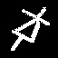
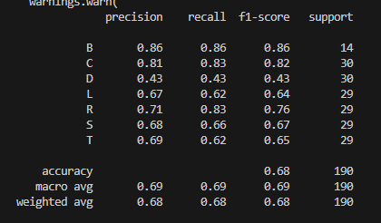
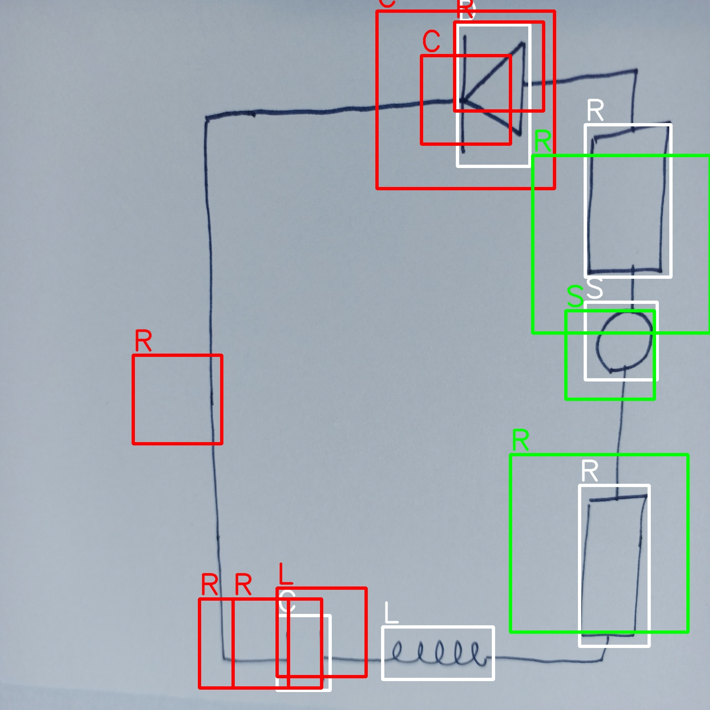

# Detection and recognition of six electronic components

--PL-- 

Projekt miał na celu detekcję interesujących komponentów na obrazie oraz ich identyfikację. Wykorzystanymi elementami były - rezystor, cewka, dioda, tranzystor, źródło i kondensator. 
Obrazy miały zawierać ręcznie narysowane komponenty na kartkach zarówno czystych jak i w kratkę.

Preprocessing:
Przetwarzanie wstępne dla zbioru trenującego stanowiło wyzwanie pod względem różnorodności tychże zdjęć. Starano się jak najlepiej dostosować parametry aby komponent na obrazie był jak najbardziej wyraźny i odseparowany od ewentualnej kratki na kartce czy rzucanego cienia.

Kroki zastosowane do przygotowania danych pojedynczych do treningu wyglądają następująco:
-Wczytanie obrazu,
-Przeskalowanie,
-Konwersja do skali szarości,
-Dylacja, z minimalnym kernelem,
-Progowanie przy użyciu metody cv2.THRESH\_BINARY lub cv2.THRESH\_OTSU.
-Złożenie obrazu po progowaniu i przed przy użyciu binarnej operacji AND,
-Usuwanie pionowych i poziomych linii. W tym kroku obliczana jest średnia ilość występowania białych pikseli w wierszu lub kolumnie. Jeśli średnia wartość przekracza pewny, wyznaczony empirycznie, próg - wiersz lub kolumna ustawiane są na kolor czarny.
-Usunięcie szumów funkcją cv2.fastNlMeansDenoising,
-Morfologiczne zamknięcie
-Zapis przerobionego pliku  

Zdjęcia uzyskane powyższymi krokami i po ręcznym czyszczeniu są umieszczone w folderze output_of_preproc/. Przykładowo, udało się uzyskać następujące transformacje:

Następnie algorytmem HoG dokonano ekstrakcji cech, których użyto do wytrenowania modelu SVM, dostępnego w bibliotece scikit-learn. Obrazy trenujące zostały podzielone na zbiory trenujący (0.8 obrazów), na których został wytrenowany model, oraz testujące (0.2 obrazów) w celu weryfikacji działania modelu. Dodatkowo utworzono klasę 'B', która przedstawia białą kartkę (czystą lub w kratkę) a także krawędzie połączeń - generalnie to, co nie jest żadnym z komponentów elektronicznych.

Trening modelu SVM odbywał się na pojedynczych obrazkach komponentów (wyciętych z całej kartki), przeskalowanych z \(128 \times 128\) do \(64 \times 64\). 

Na powyższym zdjęciu, dobrze widać, że wytrenowany model SVM nie ma bardzo wysokiej skuteczności, bo ok. 68\%.

Następnie powtórzono trening, przy którym zmieniono nieco parametry aby dostać dobre jakościowo zdjęcia już od razu w rozmiarze \(64 \times 64\), a także utworzono "podwójny" zbiór treningowy z nieco różniących się zdjęć uzyskanych innymi parametrami preprocessingu. Przed treningiem, ręcznie czyszczono zbiór trenujący z bardzo zdeformowanych obrazków, tak samo jak przy treningu poprzedniego modelu. Tym razem skuteczność znacznie się podwyższyła wraz ze wzrostem ilości i jakości danych - uzyskana skuteczność na zbiorze testowym ok. 86\%.

Przykładowe działanie:

